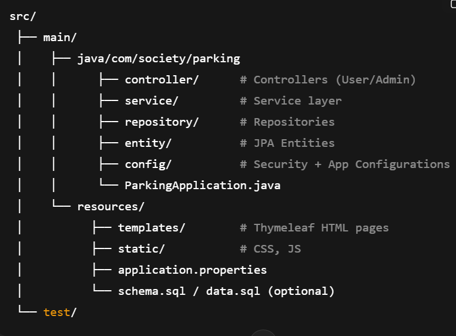
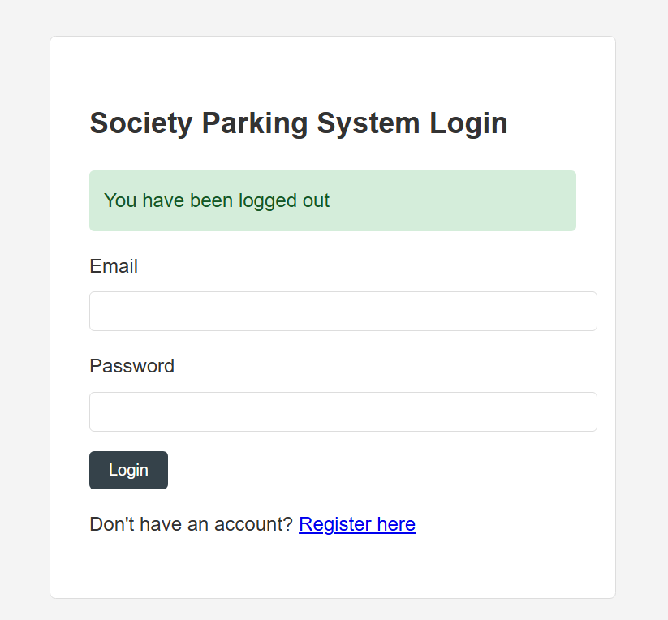
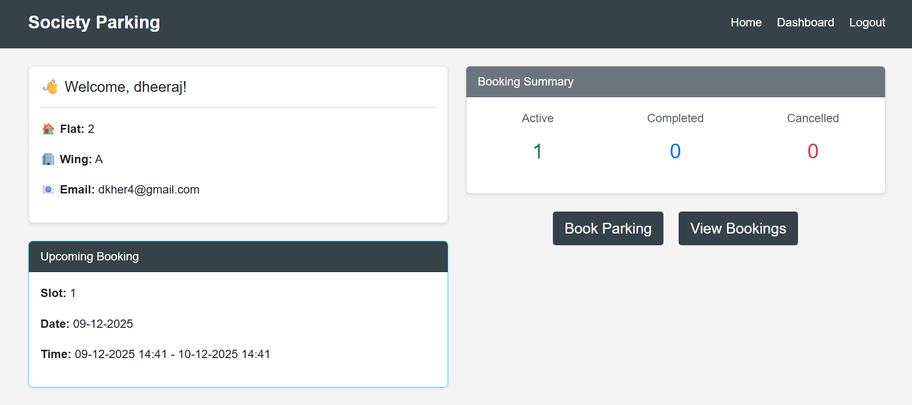
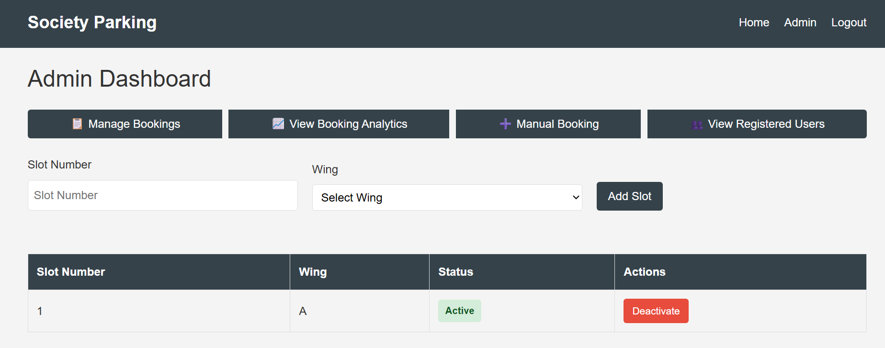
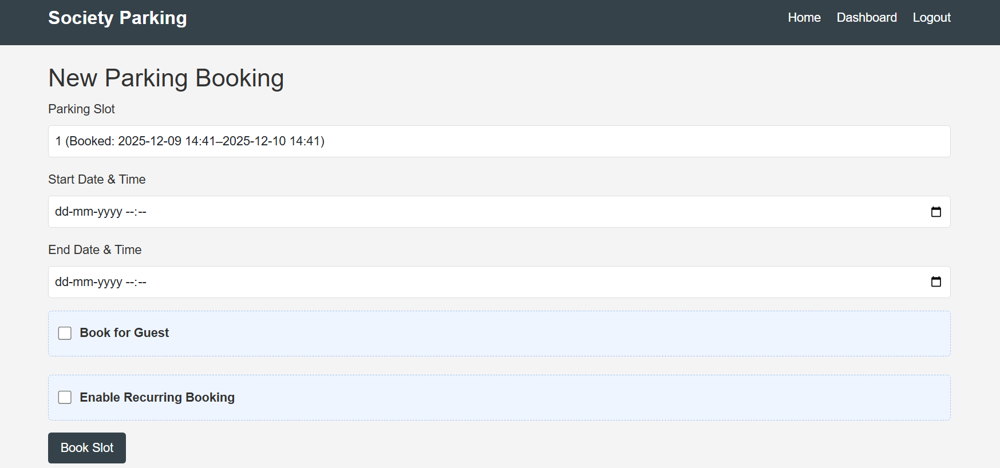

live at
https://societyparking.onrender.com/login

🚗 Society Parking Slot Reservation System

A Spring Boot–based Parking Management System that allows residents and guests to book parking slots, manage reservations, and handle admin operations efficiently.

📌 Features
🔐 Authentication & Authorization

-Login & registration

-Role-based access — Admin & User

🚘 User Features

-Book parking slots

-Check available slots

-Cancel bookings

-View booking history

-Guest/resident parking support

-Wing-based slot validation

-Email notification for booking confirmation (if configured)

🛠️ Admin Features

-Add/update/remove parking slots

-Manage users

-Approve/deny guest bookings

-View all bookings

-Dashboard with booking analytics

-Manage wings & slot capacity

📊 Advanced Features

-Recurring bookings

-Auto-cancellation rules

-Validation for overlapping bookings

-Search bookings using custom finder methods

🏗️ Tech Stack

-Java 17+	Backend Language

Spring Boot	Core -framework

Spring MVC	-Web handling

Spring Security	-Authentication & authorization

Hibernate + JPA	- ORM & database mapping

MySQL	-Database

Thymeleaf	- UI templates

Bootstrap	- Frontend styling

📂 Project Structure

⚙️ Setup Instructions

1️⃣ Clone the Repository
git clone https://github.com/dheerajkaushik/SocietyParking.git

cd SocietyParking

2️⃣ Configure MySQL

-Create a database:

-CREATE DATABASE society_parking;

Update application.properties:

spring.datasource.url=jdbc:mysql://localhost:3306/society_parking
spring.datasource.username=your_username
spring.datasource.password=your_password

spring.jpa.hibernate.ddl-auto=update
spring.jpa.show-sql=true

3️⃣ Run the Application

mvn spring-boot:run

4️⃣ Access the Application

User dashboard → http://localhost:8080/user/dashboard

Admin dashboard → http://localhost:8080/admin/dashboard

Login → http://localhost:8080/login

🐳 Deploy on Render (Docker)

📄 Dockerfile

FROM eclipse-temurin:17-jdk-alpine

WORKDIR /app

COPY . .

RUN ./mvnw clean package -DskipTests

EXPOSE 8080

CMD ["java", "-jar", "target/*.jar"]

->Render Deployment Steps

-Create new Web Service

-Connect your GitHub repo

Choose:

-Environment: Docker

-Port: 8080

-Deploy

-View logs & wait for build completion

📸 Screenshots (Add later)

Login page

User dashboard

Admin dashboard

Booking screen

🤝 Contributing

Pull requests are welcome!
For major changes, open an issue first to discuss your proposal.

📜 License

This project is licensed under the MIT License.